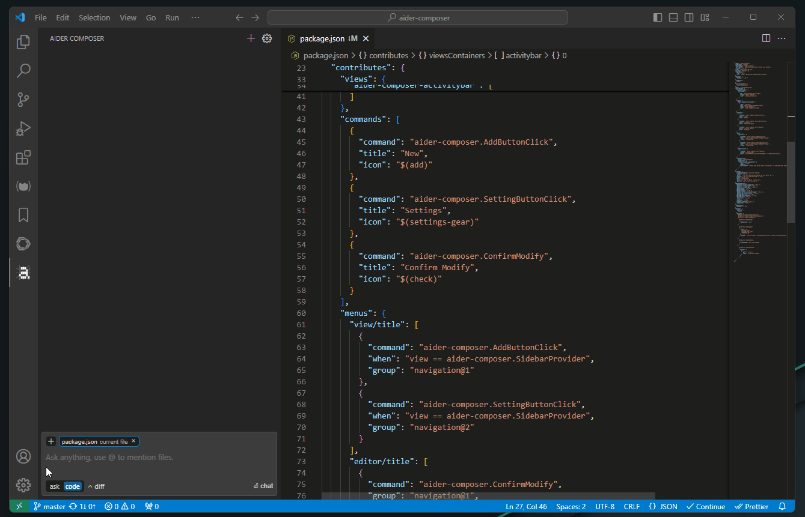

# aider-composer

Aider Composer is a VSCode extension that allows you to integrate [Aider](https://github.com/Aider-AI/aider) into your development workflow. this extension is highly inspired by [cursor](https://www.cursor.com/) and [cline](https://github.com/cline/cline).

It is very recommended to read [Requirements](#requirements) and [Extension Settings](#extension-settings) for startup config, otherwise the extension may not work correctly.

## Features

- easily add and drop file, and toggle between read-only and editable modes with just a click.
- most of the chat mode is supported, including `ask` `diff` `diff-fenced` `udiff` `whole`, and you can easily switch between them.
- review code changes before applying them.
- HTTP Proxy is supported, use VSCode settings `http.proxy` to configure and don't support authentication.

### Note

because of some limitation or other issues, this extension may not implement all features in Aider, some are listed here:

- multiple workspaces are not supported
- git, extension will not use git repo features
- lint
- test
- voice
- in-chat commands are not usable
- configuration is not supported

## Requirements

This extension use python package `aider.chat` and `flask` to provide background service, so you should install them first.

- install Python
- install `aider.chat` and `flask` package

## Extension Settings

This extension contributes the following settings:

- `aider-composer.pythonPath`: Path that includes the Python executable and the `aider.chat`, `flask` package is installed. this is required before you can use this extension. if you not set this, extension will not be activated.

---

**Enjoy!**
